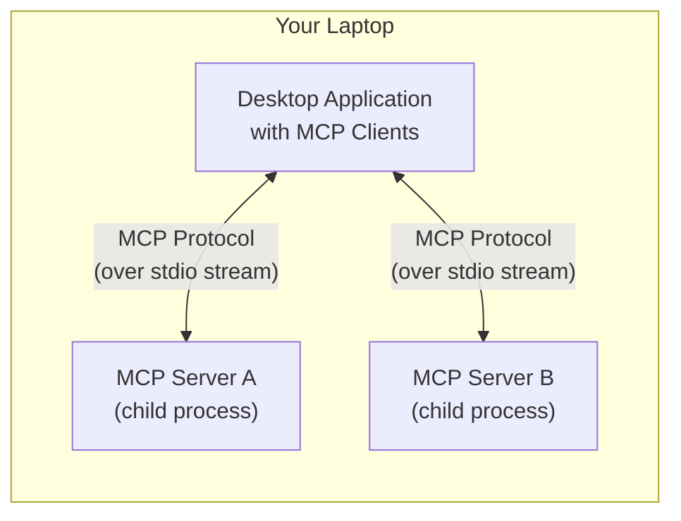
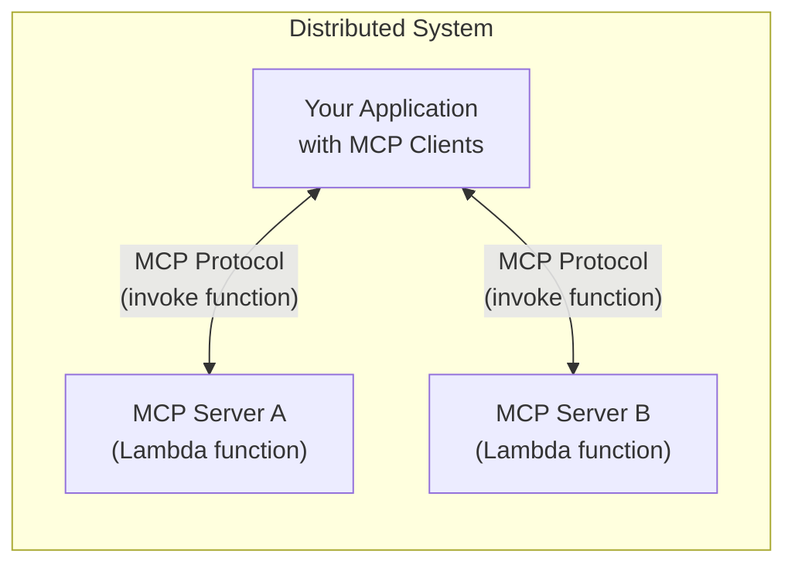

# Utilities for Model Context Protocol (MCP) with AWS Lambda

This project enables you to run [Model Context Protocol](https://modelcontextprotocol.io) servers in AWS Lambda functions.

Currently, most implementations of MCP servers and clients are entirely local on a single machine.
A desktop application such as an IDE or Claude Desktop initiates MCP servers locally as child processes
and communicates with each of those servers over a long-running stdio stream.



This MCP server adapter for AWS Lambda helps you to wrap existing stdio MCP servers into Lambda functions.
You can invoke these function-based MCP servers from your application using the MCP protocol
over short-lived connections.
Your application can then be a desktop-based app, a distributed system running in the cloud,
or any other architecture.
The only requirement is that your application has access to invoke your Lambda functions.



## Considerations

- This package currently supports MCP servers and clients written in Python and Typescript.
  Other languages such as Kotlin are not supported.
- The server adapters only adapt stdio MCP servers, not servers written for other protocols such as SSE.
- The server adapters does not maintain any MCP server state across Lambda function invocations.
  Only stateless MCP servers are a good fit for using this adapter. For example, MCP servers
  that invoke stateless tools like the [time MCP server](https://github.com/modelcontextprotocol/servers/tree/main/src/time)
  or make stateless web requests like the [fetch MCP server](https://github.com/modelcontextprotocol/servers/tree/main/src/fetch).
  Stateful MCP servers are not a good fit, because they will lose their state on every request.
  For example, MCP servers that manage data on disk or in memory such as
  the [sqlite MCP server](https://github.com/modelcontextprotocol/servers/tree/main/src/sqlite),
  the [filesystem MCP server](https://github.com/modelcontextprotocol/servers/tree/main/src/filesystem),
  and the [git MCP server](https://github.com/modelcontextprotocol/servers/tree/main/src/git).
- The server adapters ignore any MCP protocol notifications from the client to the server.
- The server adapters do not provide mechanisms for managing any secrets needed by the wrapped
  MCP server. For example, the [GitHub MCP server](https://github.com/modelcontextprotocol/servers/tree/main/src/github)
  and the [Brave search MCP server](https://github.com/modelcontextprotocol/servers/tree/main/src/brave-search)
  require API keys to make requests to third-party APIs.
  You can configure these API keys as
  [encrypted environment variables](https://docs.aws.amazon.com/lambda/latest/dg/configuration-envvars-encryption.html)
  in the Lambda function's configuration. However, note that anyone with access to invoke the Lambda function
  will then have access to use your API key to call the third-party APIs by invoking the function.
  We recommend limiting access to the Lambda function using
  [least-privilege IAM policies](https://docs.aws.amazon.com/lambda/latest/dg/security-iam.html).

## Examples

### Python server example

This project includes an
[example Python Lambda function](examples/servers/time/function/index.py)
that runs the simple
[MCP 'time' reference server](https://github.com/modelcontextprotocol/servers/tree/main/src/time).
The Lambda function bundles the [mcp-server-time package](https://pypi.org/project/mcp-server-time/).
On each function invocation, the Lambda function will manage the lifecycle of the bundled MCP server.
It will:

1. start the 'time' MCP server as a child process
1. initialize the MCP server
1. forward the incoming request to the local server
1. return the server's response to the function caller
1. shut down the MCP server child process

```python
import sys
from mcp.client.stdio import StdioServerParameters
from mcp_lambda import stdio_server_adapter

server_params = StdioServerParameters(
    command=sys.executable,
    args=[
        "-m",
        "mcp_server_time",
        "--local-timezone",
        "America/New_York",
    ],
)


def handler(event, context):
    return stdio_server_adapter(server_params, event, context)
```

### Typescript server example

This project includes an
[example Node.js Lambda function](examples/servers/weather-alerts/lib/weather-alerts-mcp-server.function.ts)
that runs an [OpenAPI MCP server](https://github.com/snaggle-ai/openapi-mcp-server/)
to provide a single API from [weather.gov](https://www.weather.gov/documentation/services-web-api) as a tool.
The Lambda function bundles the [openapi-mcp-server package](https://www.npmjs.com/package/openapi-mcp-server).
On each function invocation, the Lambda function will manage the lifecycle of the bundled MCP server.
It will:

1. start the 'openapi-mcp-server' MCP server as a child process
1. initialize the MCP server
1. forward the incoming request to the local server
1. return the server's response to the function caller
1. shut down the MCP server child process

```typescript
import { Handler, Context } from "aws-lambda";
import { stdioServerAdapter } from "mcp-lambda";

const serverParams = {
  command: "npx",
  args: ["--offline", "openapi-mcp-server", "./weather-alerts-openapi.json"],
};

export const handler: Handler = async (event, context: Context) => {
  return await stdioServerAdapter(serverParams, event, context);
};
```

### Python client example

This project includes an
[example Python MCP client](examples/chatbots/python/server_clients/lambda_function.py)
that invokes the 'time' MCP server function from above.
The client invokes a Lambda function named "mcp-server-time" with a payload that is compliant
with the MCP protocol and returns the function's response to the caller.

```python
from mcp import ClientSession
from mcp_lambda import LambdaFunctionParameters, lambda_function_client

server_params = LambdaFunctionParameters(
    function_name="mcp-server-time",
    region_name="us-east-2",
)

read, write = await lambda_function_client(server_params)
session = ClientSession(read, write)
await session.initialize()
```

### Deploy and run the examples

First, install the [AWS CDK CLI](https://docs.aws.amazon.com/cdk/v2/guide/getting_started.html#getting_started_install).

Install the mcp-lambda Python module from source:

```bash
cd src/python/

uv venv
source .venv/bin/activate

uv sync --all-extras --dev

# For development
uv run ruff check .
uv run pyright
uv run pytest
```

Deploy the Lambda 'time' function - the deployed function will be named "mcp-server-time".

```bash
cd examples/servers/time/

uv pip install -r requirements.txt

cdk deploy --app 'python3 cdk_stack.py'
```

Build the mcp-lambda Typescript module:

```bash
cd src/typescript/

npm install

npm run build

npm link
```

Deploy the Lambda 'weather-alerts' function - the deployed function will be named "mcp-server-weather-alerts".

```bash
cd examples/servers/weather-alerts/

npm install

npm link mcp-lambda

npm run build

cdk deploy --app 'node lib/weather-alerts-mcp-server.js'
```

Run the Python-based chatbot client:

```bash
cd examples/chatbots/python/

uv pip install -r requirements.txt

python main.py
```

Alternatively, run the Typescript-based chatbot client:

```bash
cd examples/chatbots/typescript/

npm install

npm link mcp-lambda

npm run build

npm run start
```

The chatbot client will communicate with three servers:

1. the Lambda function-based 'time' MCP server
2. the Lambda function-based 'weather-alerts' MCP server
3. a [local 'fetch' MCP server](https://github.com/modelcontextprotocol/servers/tree/main/src/fetch)

To use the remote 'time' server, you can ask the chatbot questions like "What is the current time?".

To use the remote 'weather-alerts' server, you can ask the chatbot questions like "Are there any weather alerts right now?".

To use the local 'fetch' server, you can ask questions like "Who is Tom Cruise?".

## Security

See [CONTRIBUTING](CONTRIBUTING.md#security-issue-notifications) for more information.

## License

This project is licensed under the Apache-2.0 License.
