# 🏗️ Architecture Diagrams - MCP Demo

This document contains detailed architecture diagrams and explanations for the MCP Demo application.

## 📋 Table of Contents

1. [System Overview](#system-overview)
2. [Component Architecture](#component-architecture)
3. [Data Flow](#data-flow)
4. [Security Architecture](#security-architecture)
5. [Deployment Architecture](#deployment-architecture)
6. [MCP Integration](#mcp-integration)

## 🎯 System Overview

### High-Level Architecture

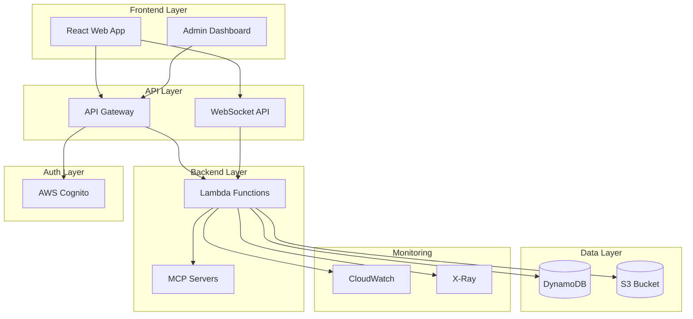

### Technology Stack

| Layer                | Technology                  | Purpose                      |
| -------------------- | --------------------------- | ---------------------------- |
| **Frontend**         | React + TypeScript + Vite   | Modern web application       |
| **Styling**          | Tailwind CSS                | Utility-first CSS framework  |
| **State Management** | React Hooks                 | Local state management       |
| **API Layer**        | API Gateway + WebSocket API | HTTP and WebSocket endpoints |
| **Backend**          | AWS Lambda + Node.js        | Serverless compute           |
| **Database**         | DynamoDB                    | NoSQL database               |
| **Storage**          | S3 + CloudFront             | Static file hosting          |
| **Authentication**   | AWS Cognito                 | User authentication          |
| **Monitoring**       | CloudWatch + X-Ray          | Observability                |
| **Infrastructure**   | AWS CDK                     | Infrastructure as code       |

## 🧩 Component Architecture

### Hexagonal Architecture Implementation

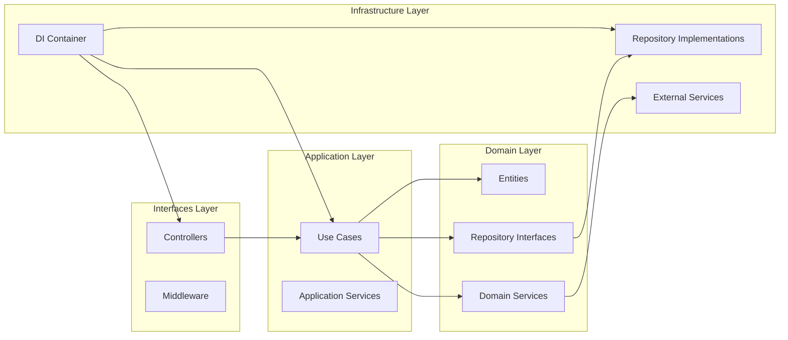

### Package Structure

```
demo/
├── applications/
│   ├── api/                    # Backend API
│   │   ├── src/
│   │   │   ├── domain/         # Domain layer
│   │   │   │   ├── entities/   # Business entities
│   │   │   │   ├── repositories/ # Repository interfaces
│   │   │   │   └── services/   # Domain services
│   │   │   ├── application/    # Application layer
│   │   │   │   └── use-cases/  # Business use cases
│   │   │   ├── interfaces/     # Interfaces layer
│   │   │   │   └── controllers/ # HTTP controllers
│   │   │   └── infrastructure/ # Infrastructure layer
│   │   │       ├── repositories/ # Repository implementations
│   │   │       ├── services/   # External service implementations
│   │   │       └── middleware/ # Authentication & logging
│   │   └── tests/              # Test files
│   └── web/                    # Frontend application
│       ├── src/
│       │   ├── components/     # React components
│       │   ├── hooks/          # Custom React hooks
│       │   ├── utils/          # Utility functions
│       │   └── types/          # TypeScript types
│       └── tests/              # Test files
├── infrastructure/
│   └── aws/                    # AWS CDK infrastructure
│       ├── src/
│       │   ├── stacks/         # CDK stacks
│       │   ├── functions/      # Lambda function definitions
│       │   └── config/         # Environment configuration
│       └── scripts/            # Deployment scripts
└── packages/
    ├── shared/                 # Shared utilities
    └── types/                  # Shared TypeScript types
```

## 🔄 Data Flow

### Chat Message Flow

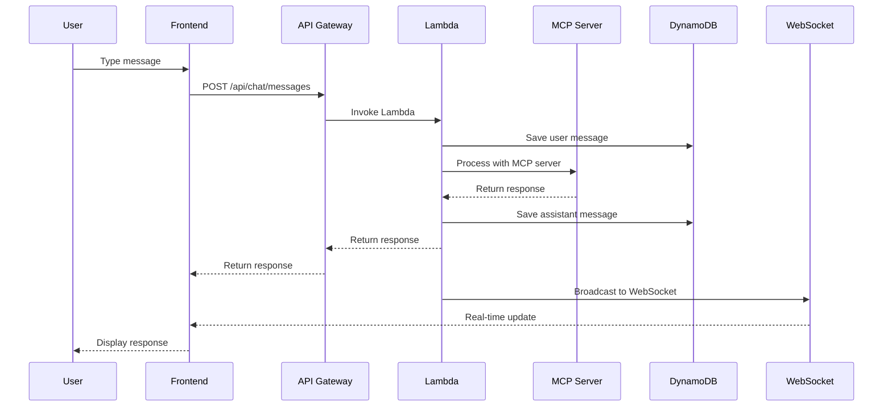

### Authentication Flow

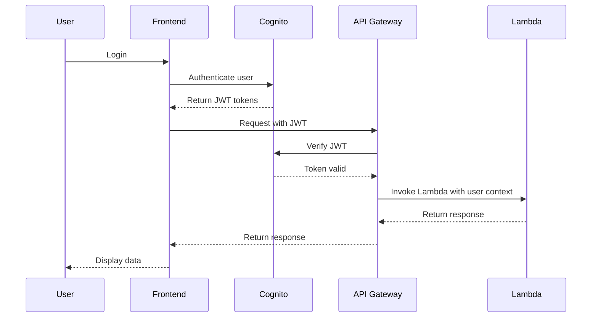

### WebSocket Flow

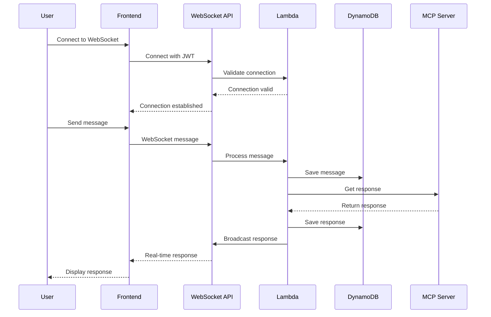

## 🔐 Security Architecture

### Authentication & Authorization

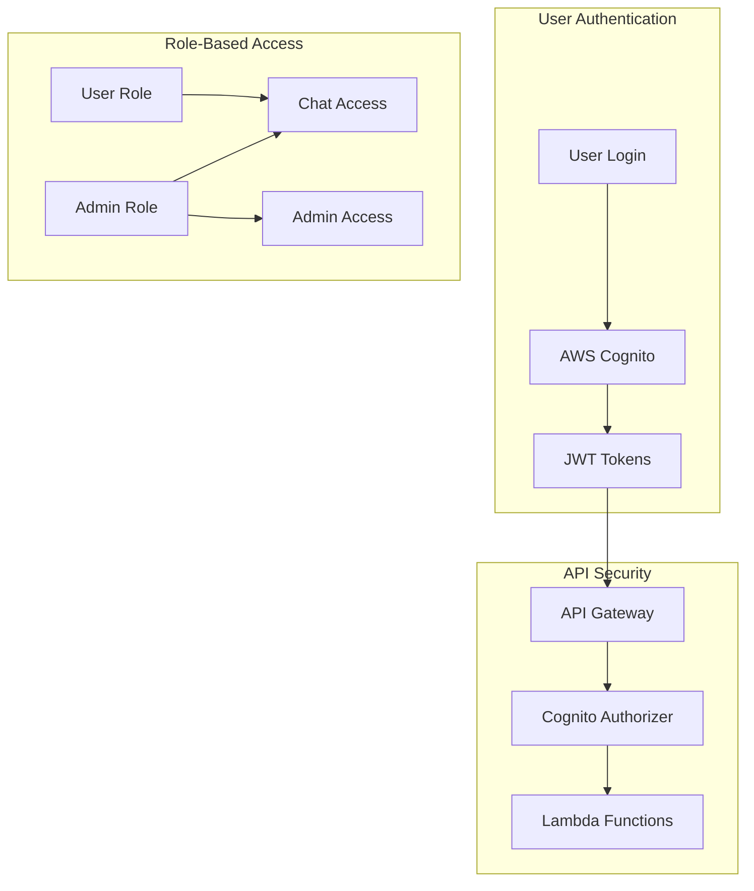

### Security Layers

| Layer           | Security Measure    | Purpose                 |
| --------------- | ------------------- | ----------------------- |
| **Network**     | HTTPS/TLS           | Encrypt data in transit |
| **API Gateway** | Cognito Authorizer  | JWT validation          |
| **Lambda**      | IAM Roles           | Least privilege access  |
| **Database**    | Encryption at rest  | Data protection         |
| **Storage**     | S3 bucket policies  | Access control          |
| **CDN**         | CloudFront security | DDoS protection         |

## 🚀 Deployment Architecture

### AWS Infrastructure

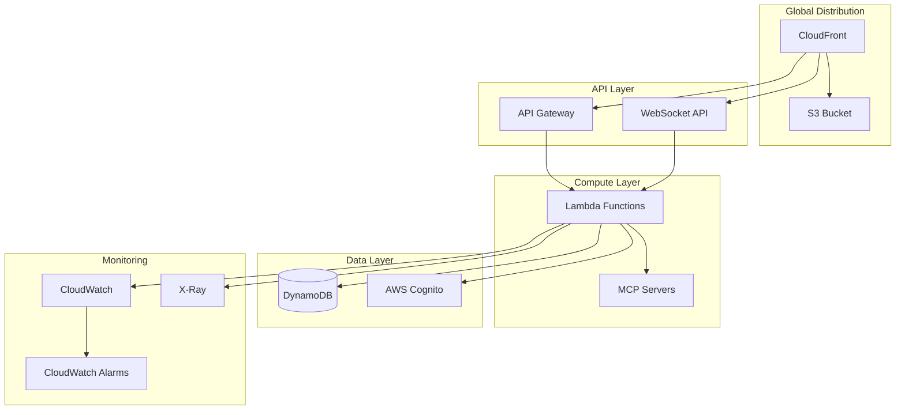

### Environment Strategy

```mermaid
graph LR
    subgraph "Development"
        Dev[Dev Environment]
        DevInfra[Dev Infrastructure]
    end

    subgraph "Staging"
        Staging[Staging Environment]
        StagingInfra[Staging Infrastructure]
    end

    subgraph "Production"
        Prod[Production Environment]
        ProdInfra[Production Infrastructure]
    end

    Dev --> DevInfra
    Staging --> StagingInfra
    Prod --> ProdInfra
```

## 🔌 MCP Integration

### MCP Server Architecture

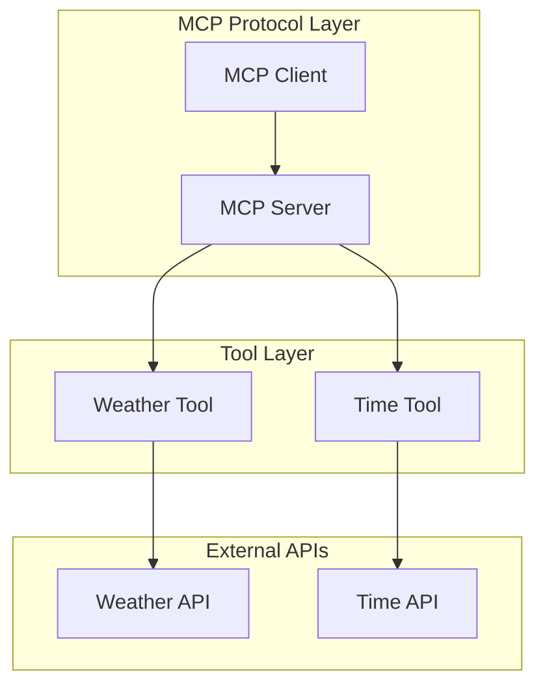

### MCP Message Flow

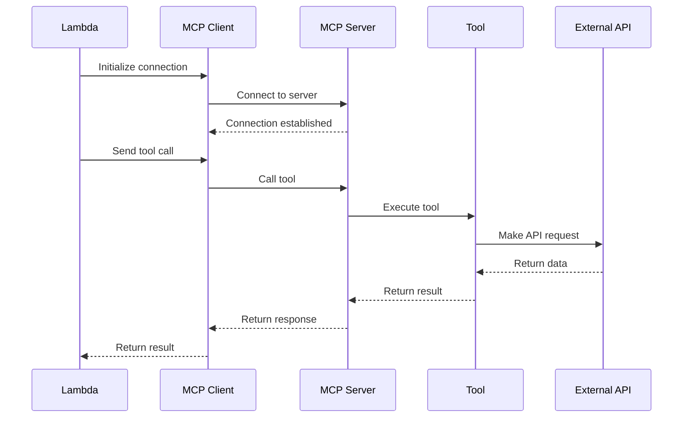

## 📊 Monitoring & Observability

### Observability Stack

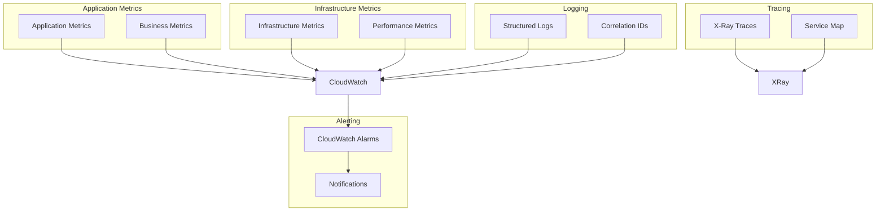

### Key Metrics

| Category           | Metric                | Description                   |
| ------------------ | --------------------- | ----------------------------- |
| **Performance**    | Response Time         | API response latency          |
| **Reliability**    | Error Rate            | Percentage of failed requests |
| **Business**       | Messages Sent         | Total messages processed      |
| **Business**       | Active Sessions       | Current active users          |
| **Infrastructure** | Lambda Invocations    | Function execution count      |
| **Infrastructure** | DynamoDB Reads/Writes | Database operations           |

## 🔧 Development Workflow

### CI/CD Pipeline

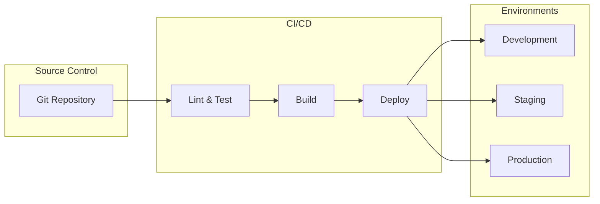

### Development Process

1. **Feature Development**

   - Create feature branch
   - Implement changes
   - Add tests
   - Update documentation

2. **Code Quality**

   - Run linting
   - Execute tests
   - Check type safety
   - Review code

3. **Deployment**
   - Build applications
   - Deploy infrastructure
   - Deploy applications
   - Run smoke tests

## 📈 Scalability Considerations

### Horizontal Scaling

- **Lambda Functions**: Auto-scale based on demand
- **API Gateway**: Handles traffic spikes
- **DynamoDB**: Auto-scaling tables
- **CloudFront**: Global CDN distribution

### Performance Optimization

- **Connection Pooling**: Reuse database connections
- **Caching**: Implement caching strategies
- **Compression**: Gzip responses
- **CDN**: Static asset delivery

## 🔮 Future Enhancements

### Planned Improvements

1. **Advanced Analytics**

   - User behavior tracking
   - Performance analytics
   - Business intelligence

2. **Enhanced Security**

   - Rate limiting
   - WAF integration
   - Advanced monitoring

3. **Performance Optimization**

   - Caching layer
   - Database optimization
   - CDN improvements

4. **Developer Experience**
   - Better debugging tools
   - Local development improvements
   - Documentation enhancements

---

**This architecture provides a solid foundation for a scalable, maintainable, and secure MCP Demo application.**
